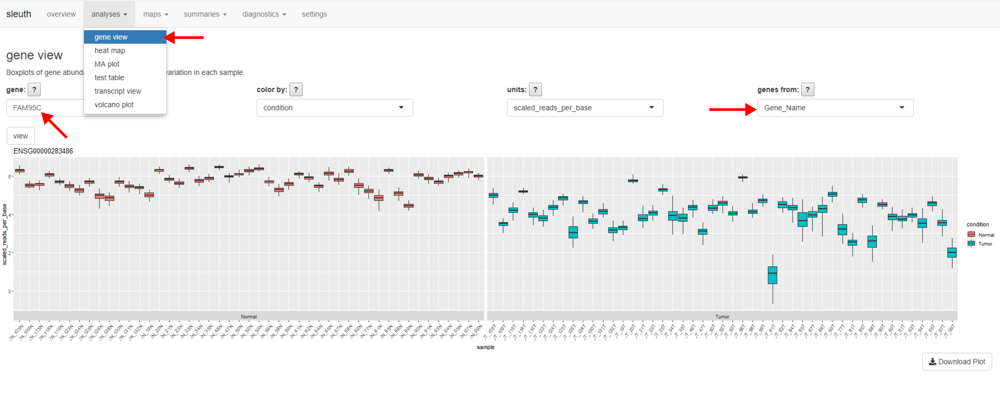

# Viewing PTC Data in RStudio/Sleuth

## RStudio

See Rstudio [download page](https://rstudio.com/products/rstudio/download/) for instructions. Note that Shiny GUI tools are built in.

## Installing Sleuth
Run the below commands one-by-one:

`install.packages("BiocManager")`

`library(BiocManager)`

`BiocManager::install("rhdf5")`

`BiocManager::install("biomaRt")`

`install.packages("gridExtra")`

`install.packages("devtools")`

`devtools::install_github("pachterlab/sleuth")`

## Loading packages

`library(rhdf5)`

`library(sleuth)`

`library(biomaRt)`

`library(gridExtra)`

## Importing the prepared PTC dataset
1. Set working directory to location of the downloaded so.rds `setwd(/path/to/directory/)`

2. Save read the RDS file as "so" `so <-readRDS('so.rds')`

3. Visualize the data `sleuth_live(so)`

## User Interface
**Sleuth Live Example:**

Tips:
- Case matters. Human gene names should be capitalized 
- Select "Gene_Name" from the dropdown menu as shown above when searching for single-gene expression across samples.
- Use the top menu to select from other pre-prepared plots and figures.
- This object can be used to manipulate data, export tables and create new figures in the R commandline (outside of sleuth_live).
